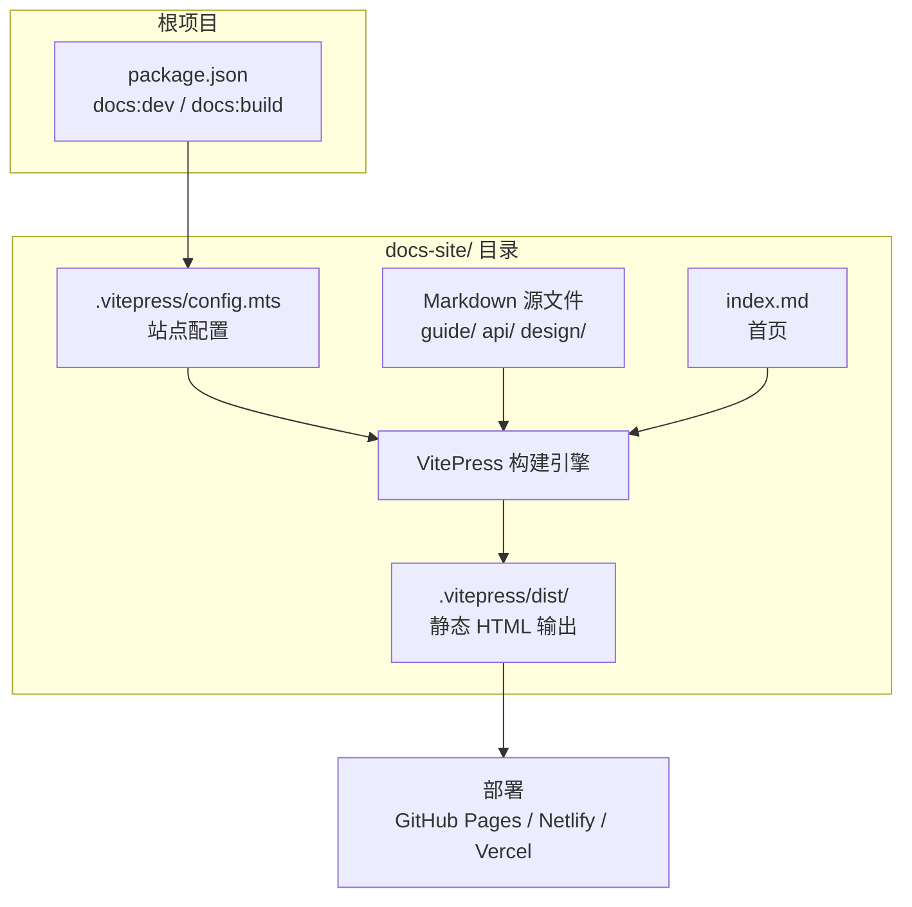
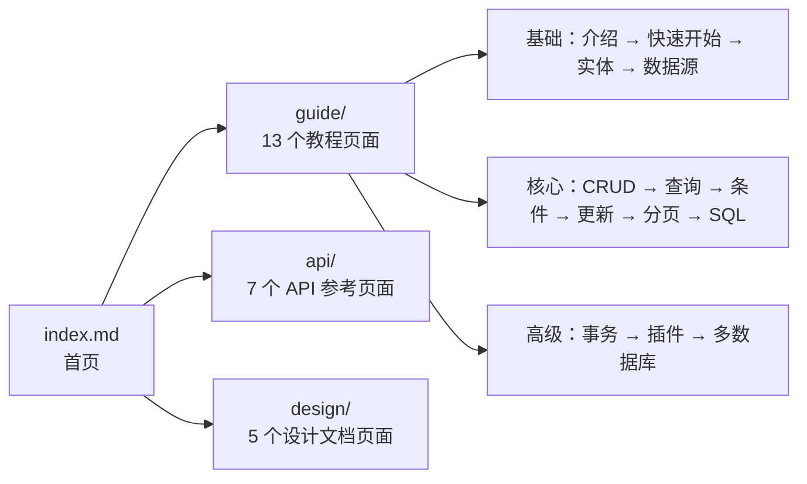

# 设计文档：node-mybatis-plus 官方文档站点

## 概述

基于 VitePress 为 node-mybatis-plus ORM 库构建官方文档站点。站点采用 VitePress 默认主题，包含首页、使用指南、API 参考和设计文档四大分区，支持中文界面、本地搜索和响应式布局。

文档站点作为独立子项目位于 `docs-site/` 目录下，与主库源码分离，拥有独立的 `package.json` 和构建流程。内容来源于现有 `docs/` 目录中的文档和 `src/` 中的类型定义，经过重新组织和扩充后形成完整的文档体系。

### 关键设计决策

1. **独立目录 `docs-site/`**：避免与现有 `docs/` 目录冲突，VitePress 配置和 Markdown 源文件集中管理
2. **VitePress 默认主题**：开箱即用的 Hero、Features、Sidebar 组件，无需自定义主题开发
3. **本地搜索（local search）**：VitePress 内置的 MiniSearch 方案，无需外部服务依赖
4. **根项目 scripts 代理**：在根 `package.json` 中添加 `docs:dev` 和 `docs:build` 脚本，方便开发者使用

## 架构

### 整体架构



### 目录结构

```
docs-site/
├── .vitepress/
│   ├── config.mts              # VitePress 站点配置（导航、侧边栏、搜索等）
│   └── dist/                   # 生产构建输出（gitignore）
├── index.md                    # 首页（Hero + Features 布局）
├── guide/
│   ├── introduction.md         # 项目介绍
│   ├── getting-started.md      # 快速开始
│   ├── entity-definition.md    # 实体定义（装饰器）
│   ├── datasource.md           # 数据源配置
│   ├── base-mapper.md          # BaseMapper CRUD
│   ├── lambda-query.md         # Lambda 链式查询
│   ├── dynamic-condition.md    # 动态条件
│   ├── lambda-update.md        # Lambda 更新
│   ├── pagination.md           # 分页查询
│   ├── custom-sql.md           # 自定义 SQL
│   ├── transaction.md          # 事务管理
│   ├── plugin.md               # 插件机制
│   └── multi-database.md       # 多数据库切换
├── api/
│   ├── decorators.md           # 装饰器 API
│   ├── base-mapper.md          # BaseMapper 方法列表
│   ├── query-wrapper.md        # LambdaQueryWrapper 方法
│   ├── update-wrapper.md       # LambdaUpdateWrapper 方法
│   ├── datasource.md           # 数据源配置选项
│   ├── plugin.md               # 插件接口定义
│   └── types.md                # 类型定义
└── design/
    ├── architecture.md         # 架构概览
    ├── sql-ast.md              # SQL AST 设计
    ├── dialect.md              # 方言系统
    ├── transaction.md          # 事务实现
    └── plugin-system.md        # 插件系统设计
```

## 组件与接口

### 1. VitePress 配置（`.vitepress/config.mts`）

站点配置是整个文档站点的核心，定义了导航、侧边栏、搜索和主题行为。

```ts
import { defineConfig } from 'vitepress'

export default defineConfig({
  lang: 'zh-CN',
  title: 'node-mybatis-plus',
  description: 'MyBatis-Plus 风格的 Node.js ORM 库',

  themeConfig: {
    nav: [/* 顶部导航 */],
    sidebar: {/* 分区侧边栏 */},
    search: { provider: 'local' },
    socialLinks: [{ icon: 'github', link: '...' }],
  },
})
```

#### 导航栏配置

```ts
nav: [
  { text: '指南', link: '/guide/introduction' },
  { text: 'API 参考', link: '/api/decorators' },
  { text: '设计文档', link: '/design/architecture' },
  { text: 'GitHub', link: 'https://github.com/...' },
]
```

#### 侧边栏配置

采用多侧边栏模式，根据 URL 路径前缀自动切换：

```ts
sidebar: {
  '/guide/': [
    {
      text: '基础',
      items: [
        { text: '项目介绍', link: '/guide/introduction' },
        { text: '快速开始', link: '/guide/getting-started' },
        { text: '实体定义', link: '/guide/entity-definition' },
        { text: '数据源配置', link: '/guide/datasource' },
      ],
    },
    {
      text: '核心功能',
      items: [
        { text: 'BaseMapper CRUD', link: '/guide/base-mapper' },
        { text: 'Lambda 链式查询', link: '/guide/lambda-query' },
        { text: '动态条件', link: '/guide/dynamic-condition' },
        { text: 'Lambda 更新', link: '/guide/lambda-update' },
        { text: '分页查询', link: '/guide/pagination' },
        { text: '自定义 SQL', link: '/guide/custom-sql' },
      ],
    },
    {
      text: '高级功能',
      items: [
        { text: '事务管理', link: '/guide/transaction' },
        { text: '插件机制', link: '/guide/plugin' },
        { text: '多数据库切换', link: '/guide/multi-database' },
      ],
    },
  ],
  '/api/': [/* API 分区侧边栏 */],
  '/design/': [/* 设计文档分区侧边栏 */],
}
```

### 2. 首页（`index.md`）

使用 VitePress 默认主题的 `layout: home` frontmatter 配置：

```yaml
---
layout: home
hero:
  name: node-mybatis-plus
  text: MyBatis-Plus 风格的 Node.js ORM
  tagline: 类型安全的链式查询、动态 SQL、通用 CRUD，一套代码切换多数据库
  actions:
    - theme: brand
      text: 快速开始
      link: /guide/getting-started
    - theme: alt
      text: GitHub
      link: https://github.com/...
features:
  - icon: 🔗
    title: Lambda 链式查询
    details: 类型安全的条件构造器，IDE 自动补全字段名
  - icon: 🎯
    title: 动态 SQL
    details: 条件为 false 时自动跳过，告别 if-else 拼 SQL
  - icon: 🗄️
    title: 多数据库支持
    details: MySQL / PostgreSQL / SQLite，一套代码切换数据库
  - icon: 📦
    title: 通用 CRUD
    details: BaseMapper 内置 insert / delete / update / select 全家桶
  - icon: 💉
    title: 声明式事务
    details: '@Transactional 装饰器 + AsyncLocalStorage 自动传播'
  - icon: 🔌
    title: 插件机制
    details: beforeExecute / afterExecute 钩子，支持日志、审计、SQL 改写
---
```

### 3. 内容页面组件

每个 Markdown 页面遵循统一结构：

- **标题层级**：`#` 页面标题，`##` 主要章节，`###` 子章节
- **代码块**：使用 ` ```ts ` 和 ` ```sql ` 标记语言，VitePress 自动提供语法高亮和复制按钮
- **表格**：API 参考中使用 Markdown 表格展示方法签名、参数和返回值
- **提示框**：使用 VitePress 的 `:::tip` `:::warning` `:::danger` 容器语法

### 4. 搜索组件

使用 VitePress 内置的 local search（基于 MiniSearch），配置方式：

```ts
themeConfig: {
  search: {
    provider: 'local',
    options: {
      translations: {
        button: { buttonText: '搜索文档', buttonAriaLabel: '搜索文档' },
        modal: {
          noResultsText: '无法找到相关结果',
          resetButtonTitle: '清除查询条件',
          footer: { selectText: '选择', navigateText: '切换', closeText: '关闭' },
        },
      },
    },
  },
}
```

## 数据模型

本项目为纯静态文档站点，不涉及运行时数据存储。核心"数据"是 VitePress 配置对象和 Markdown 文件内容。

### VitePress 配置结构

```ts
interface SiteConfig {
  lang: string                    // 'zh-CN'
  title: string                   // 站点标题
  description: string             // 站点描述
  themeConfig: {
    nav: NavItem[]                // 顶部导航
    sidebar: Record<string, SidebarGroup[]>  // 多侧边栏
    search: SearchConfig          // 搜索配置
    socialLinks: SocialLink[]     // 社交链接
  }
}

interface NavItem {
  text: string
  link: string
}

interface SidebarGroup {
  text: string
  collapsed?: boolean
  items: { text: string; link: string }[]
}

interface SearchConfig {
  provider: 'local'
  options?: {
    translations?: Record<string, any>
  }
}
```

### 内容组织模型



## 错误处理

### 构建阶段

| 场景 | 处理方式 |
|------|----------|
| Markdown 中存在死链接 | VitePress 构建时自动检测并报警告，配置 `ignoreDeadLinks: false` 使其构建失败 |
| 配置文件语法错误 | VitePress 启动时抛出错误并终止，开发者根据错误信息修复 |
| 缺少依赖包 | `npm install` 时报错，需确保 `vitepress` 已安装 |

### 运行时（开发服务器）

| 场景 | 处理方式 |
|------|----------|
| 端口被占用 | VitePress 自动尝试下一个可用端口 |
| 文件变更导致热更新失败 | VitePress 开发服务器自动重试，极端情况需手动重启 |

### 内容层面

| 场景 | 处理方式 |
|------|----------|
| 搜索无结果 | VitePress local search 显示"无法找到相关结果"提示 |
| 移动端侧边栏 | 屏幕宽度 < 960px 时自动折叠为抽屉式菜单（VitePress 默认行为） |

## 测试策略

### PBT 适用性评估

本项目为 VitePress 静态文档站点，主要涉及：
- VitePress 配置文件编写
- Markdown 内容页面创建
- 静态站点构建和部署

这些属于**配置和内容创建**范畴，不包含需要测试的纯函数或业务逻辑。因此，**属性基测试（PBT）不适用于本项目**。

### 测试方案

采用以下测试策略确保文档站点质量：

#### 1. 构建验证测试（Smoke Test）

验证 VitePress 站点能够成功构建：

```bash
cd docs-site && npx vitepress build
```

- 构建成功退出码为 0
- 输出目录 `.vitepress/dist/` 包含 `index.html`
- 无死链接警告

#### 2. 内容完整性检查（Example-Based）

验证所有需求中要求的页面均已创建：

- 首页 `index.md` 存在且包含 Hero 和 Features 配置
- 指南分区 13 个页面全部存在
- API 参考分区 7 个页面全部存在
- 设计文档分区 5 个页面全部存在

#### 3. 配置正确性检查（Example-Based）

验证 VitePress 配置满足需求：

- `lang` 设置为 `'zh-CN'`
- 导航栏包含指南、API 参考、设计文档、GitHub 四个入口
- 侧边栏按分区正确配置
- 搜索功能使用 `provider: 'local'`

#### 4. 响应式布局验证

VitePress 默认主题内置响应式支持：
- 桌面端（>= 960px）：完整侧边栏 + 内容区域
- 移动端（< 960px）：侧边栏折叠为抽屉菜单

此为 VitePress 框架默认行为，无需额外测试。

#### 5. 代码块功能验证

VitePress 默认主题内置代码块功能：
- TypeScript 和 SQL 语法高亮（Shiki 引擎）
- 代码块右上角复制按钮
- 复制成功视觉反馈

此为 VitePress 框架默认行为，无需额外测试。
